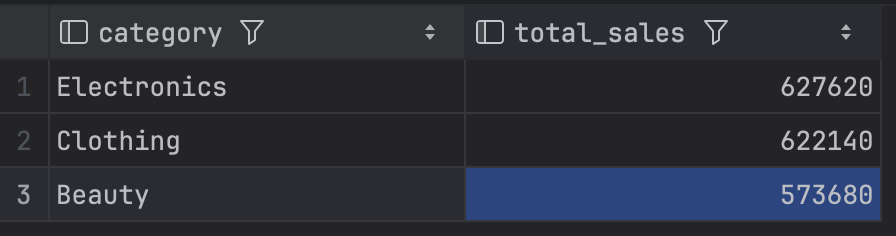
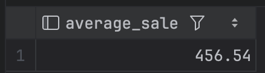
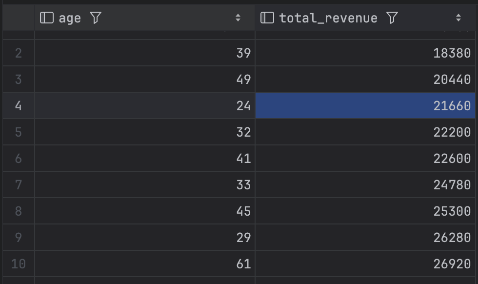
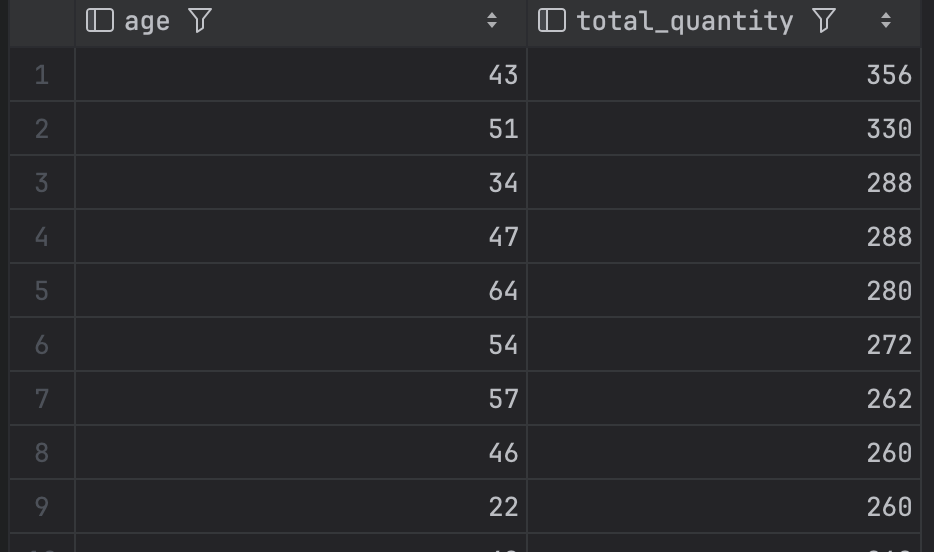
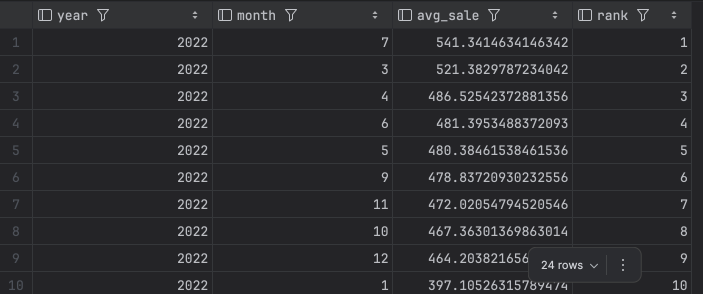
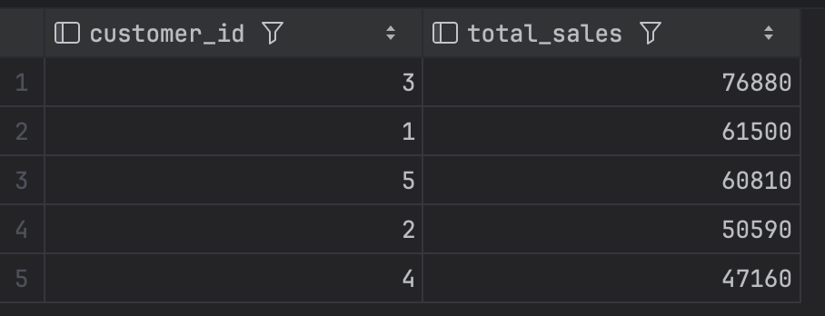
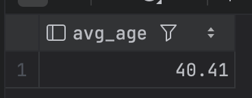
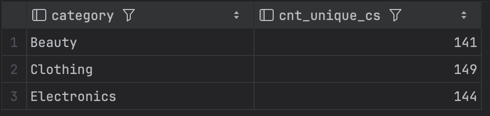
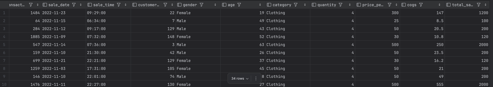
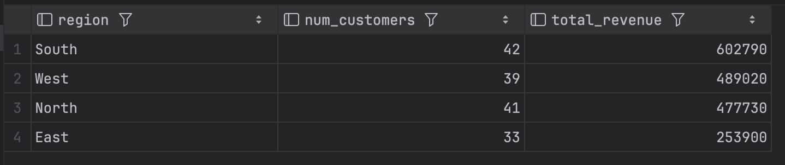

# Retail Sales Analysis SQL Project

## Project Overview

**Project Title**: Retail Sales Analysis
**Database**: `sql_project_1`

This project uses SQL to explore, clean, and analyze a retail sales dataset. It covers setting up the database, checking the data for issues, and running a series of queries  including multi-table JOINs  to answer business questions about revenue, profit, customer behavior, and regional performance.

## Objectives

1. **Set up the database**: create and populate a `retail_sales` table and a `customers` table.
2. **Clean the data**: check every column for missing values and remove incomplete records.
3. **Explore the data**: get a basic sense of row count, unique customers, and product categories.
4. **Answer business questions**: use SQL — including JOINs, CTEs, and window functions to pull out patterns in revenue, profit, and customer behavior.

## Skills Used

- **SQL** (PostgreSQL)
- **Data cleaning**: identifying and removing rows with missing values
- **Data exploration**: row counts, unique value checks
- **Aggregate functions**: SUM, AVG, COUNT, GROUP BY
- **JOINs**: combining data across multiple tables (INNER JOIN)
- **CTEs**: structuring multi-step logic with WITH clauses
- **Window functions**: RANK() for ranking within groups
- **Filtering & conditional logic**: WHERE, HAVING, date filtering

## Project Structure

### 1. Database Setup

The database `sql_project_1` holds two tables: `retail_sales`, with transaction-level sales data (transaction ID, date and time of sale, customer details, product category, quantity, pricing, cost, and total sale amount), and `customers`, with a signup date and region per customer, used to practice relational querying.

```sql
CREATE DATABASE sql_project_1;

CREATE TABLE retail_sales (
    transactions_id INT,
    sale_date DATE,
    sale_time TIME,
    customer_id INT,
    gender VARCHAR(15),
    age INT,
    category VARCHAR(15),
    quantity INT,
    price_per_unit FLOAT,
    cogs FLOAT,
    total_sale FLOAT
);

CREATE TABLE customers (
    customer_id INT,
    signup_date DATE,
    region VARCHAR(10)
);
```

### 2. Data Exploration & Cleaning

- **Row count**: total number of sales records.
- **Customer count**: number of unique customers.
- **Category count**: distinct product categories present.
- **Null check**: every column was checked for missing values, and incomplete records were removed so they wouldn't distort the aggregate results.

```sql
SELECT COUNT(transactions_id) AS total_sales FROM retail_sales;

SELECT COUNT(DISTINCT customer_id) AS total_customers FROM retail_sales;

SELECT DISTINCT category FROM retail_sales;

SELECT * FROM retail_sales
WHERE
    transactions_id IS NULL OR sale_date IS NULL OR sale_time IS NULL OR
    customer_id IS NULL OR gender IS NULL OR age IS NULL OR
    category IS NULL OR quantity IS NULL OR price_per_unit IS NULL OR
    cogs IS NULL OR total_sale IS NULL;

DELETE FROM retail_sales
WHERE
    transactions_id IS NULL OR sale_date IS NULL OR sale_time IS NULL OR
    customer_id IS NULL OR gender IS NULL OR age IS NULL OR
    category IS NULL OR quantity IS NULL OR price_per_unit IS NULL OR
    cogs IS NULL OR total_sale IS NULL;
```

### 3. Data Analysis & Findings

The following queries were written to answer specific business questions:

**1. Which product categories generate the highest total sales revenue?**

```sql
SELECT category, SUM(total_sale) AS total_sales
FROM retail_sales
GROUP BY category
ORDER BY total_sales DESC;
```

**Finding**
<br> 
Electronics has the highest revenue (627,620), just ahead of Clothing
(622,140) and Beauty (573,680). The top two are very close.

<div align="left">
  
</div>

**2. Which product categories generate the highest profit?**

```sql
SELECT category, ROUND(SUM(total_sale - cogs)::numeric, 2) AS total_profit
FROM retail_sales
GROUP BY category
ORDER BY total_profit DESC;
```

**Finding**
<br>
Clothing has the highest profit (493,359), barely beating Electronics
(493,295).
<div align="left">
  
</div>


**3. What is the average sale amount?**

```sql
SELECT ROUND(AVG(total_sale)::numeric, 2) AS average_sale
FROM retail_sales;
```
**Finding**
<br>
The average sale amount is 456.54.
<div align="left">
  
</div>

**4. Which customer age groups contribute the most revenue?**

```sql
SELECT age, ROUND(SUM(total_sale)::numeric, 2) AS total_revenue
FROM retail_sales
GROUP BY age
ORDER BY total_revenue DESC;
```
**Finding**
<br>
39 year olds contribute the most revenue.
<div align="left">
  
</div>

**5. Which age groups purchase the highest quantities of products?**

```sql
SELECT age, SUM(quantity) AS total_quantity
FROM retail_sales
GROUP BY age
ORDER BY total_quantity DESC;
```
**Finding**
<br>
43 year olds purchased the highest quantities of products.
<div align="left">
  
</div>

**6. What's the average sale per month, and which month performed best each year?**

Written as a CTE for readability:

```sql
WITH monthly_avg AS (
    SELECT
        EXTRACT(YEAR FROM sale_date) AS year,
        EXTRACT(MONTH FROM sale_date) AS month,
        AVG(total_sale) AS avg_sale,
        RANK() OVER (
            PARTITION BY EXTRACT(YEAR FROM sale_date)
            ORDER BY AVG(total_sale) DESC
        ) AS rank
    FROM retail_sales
    GROUP BY 1, 2
)
SELECT year, month, avg_sale
FROM monthly_avg
WHERE rank = 1;
```

**Finding**  
<br>
July 2022 was the best month, averaging 541.34 per sale ahead of March
(521.38) and April (486.53).
<div align="left">
  
</div>

**7. Who are the top 5 customers based on total sales?**

```sql
SELECT customer_id, SUM(total_sale) AS total_sales
FROM retail_sales
GROUP BY 1
ORDER BY 2 DESC
LIMIT 5;
```
**Finding**
<br>
Customers 3,1,5,2 and 4 are the top 5 customers on total sales.
<div align="left">
  
</div>

**8. What's the average age of customers who purchased from the 'Beauty' category?**

```sql
SELECT ROUND(AVG(age), 2) AS avg_age
FROM retail_sales
WHERE category = 'Beauty';
```
**Finding**
<br>
The average age of customers who purchased from 'beauty' category are 40 year olds.
<div align="left">
  
</div>

**9. How many unique customers purchased from each category?**

```sql
SELECT category, COUNT(DISTINCT customer_id) AS cnt_unique_cs
FROM retail_sales
GROUP BY category;
```
**Finding**  
<br>
Clothing had the most unique customers (149), followed by Electronics (144)
and Beauty (141).
<div align="left">
  
</div>

**10. Which 'Clothing' transactions had a quantity of 4 or more in November 2022?**

```sql
SELECT *
FROM retail_sales
WHERE category = 'Clothing'
    AND TO_CHAR(sale_date, 'YYYY-MM') = '2022-11'
    AND quantity >= 4;
```
**Finding**
<br>
34 transactions matched this filter, with order sizes ranging from cheap to
expensive items.
<div align="left">
  
</div>

**11. What is the total revenue and customer count for each region? (JOIN)**

```sql
SELECT c.region, COUNT(DISTINCT r.customer_id) AS num_customers, SUM(r.total_sale) AS total_revenue
FROM retail_sales r
INNER JOIN customers c
    ON r.customer_id = c.customer_id
GROUP BY c.region
ORDER BY total_revenue DESC;
```
**Finding**
<br>
South has the highest revenue (602,790), followed by West (489,020),
North (477,730), and East (253,900).
<div align="left">
  
</div>


## Reports

- **Sales summary**: total sales, average sale amount, and category-level performance.
- **Customer insights**: top-spending customers, unique customer counts per category, and regional breakdowns via JOIN.

## Conclusion

This project walks through the core SQL workflow a data analyst uses day to day: setting up a relational database, cleaning messy data, joining across tables, and translating raw transactions into answers to real business questions — which categories perform best, who the highest-value customers are, when sales peak, and how performance varies by region.


## How to Use

1. Clone this repository.
2. Run the setup section of [`sql_project_1.sql`](./sql_project_1.sql) to create the database, `retail_sales` table, and `customers` table.
3. Import the sales data into `retail_sales` and the customer data into `customers`.
4. Run the analysis queries to reproduce the findings.

## Author

**Godwill Mandou**

This project is part of my data analytics portfolio, built to practice SQL for exploratory analysis, relational querying, and business reporting.
